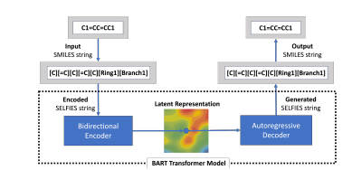

# selfies-ted

selfies-ted is an transformer based encoder decoder model for molecular representations using SELFIES.




## Usage

### Import

```
from transformers import AutoTokenizer, AutoModel
import selfies as sf
import torch
```

### Load the model and tokenizer
```
tokenizer = AutoTokenizer.from_pretrained("ibm/materials.selfies-ted")
model = AutoModel.from_pretrained("ibm/materials.selfies-ted")
```
### Encode SMILES strings to selfies
```
smiles = "c1ccccc1"
selfies = sf.encoder(smiles)
selfies = selfies.replace("][", "] [")

```
### Get embedding
```
token = tokenizer(selfies, return_tensors='pt', max_length=128, truncation=True, padding='max_length')
input_ids = token['input_ids']
attention_mask = token['attention_mask']
outputs = model.encoder(input_ids=input_ids, attention_mask=attention_mask)
model_output = outputs.last_hidden_state

input_mask_expanded = attention_mask.unsqueeze(-1).expand(model_output.size()).float()
sum_embeddings = torch.sum(model_output * input_mask_expanded, 1)
sum_mask = torch.clamp(input_mask_expanded.sum(1), min=1e-9)
model_output = sum_embeddings / sum_mask
```

### Paper:
- [SELFIES-TED : A Robust Transformer Model for Molecular Representation using SELFIES](https://openreview.net/pdf?id=uPj9oBH80V)
- [SELF-BART : A Transformer-based Molecular Representation Model using SELFIES](https://arxiv.org/abs/2410.12348)


 For more information contact indra.ipd@ibm.com